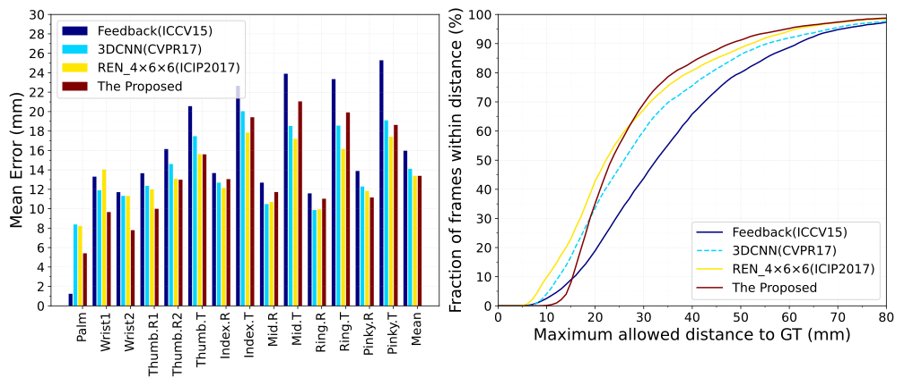
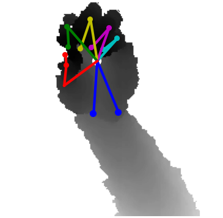
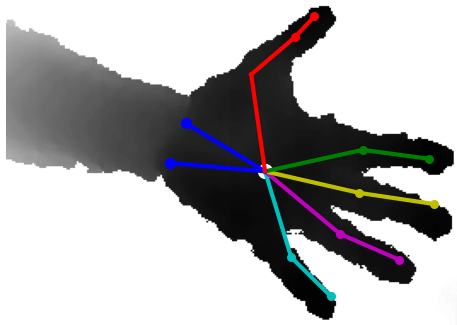
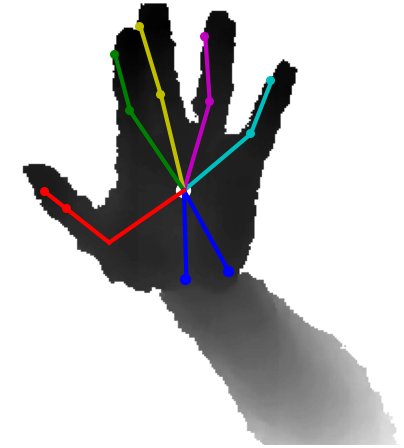
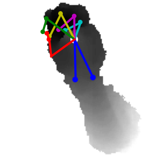
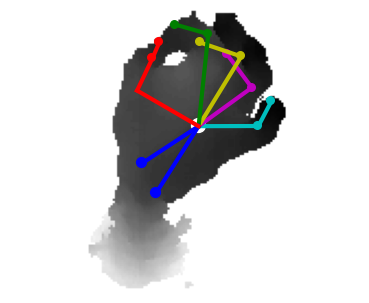

#### A simple and efficient method to estimate hand pose on depth image

 

#### 1. Requirements:

Carry out the command  `conda activate *your virutal name*`, then perform the command `pip install -r requirements.txt` 

* scipy==1.6.1

* numpy==1.16.4

* matplotlib==3.3.

* opencv-contrib-python==4.1.1.26

* opencv-python==4.1.0.25

* tensorflow-gpu==1.14.0

#### 2. Setup

[Download](https://jonathantompson.github.io/NYU_Hand_Pose_Dataset.htm#download) NYU hand pose dataset，and write the NYU dataset path in the `configs/config.yaml`.

#### 3. Pretrained models

[Download](https://drive.google.com/file/d/1s-z4hx_gIP6olbG4DH16Ut2aqv5kvgdp/view?usp=sharing) pretrained models (`.ckpt and .pb`) for NYU dataset，and put the model into the `model/` folder.

#### 4. Results

Compared to the other methods, the proposed method  is not only efficient and accurate, but it also obtains the lowest error.

| Method/3D mean error       | 3D Joints Average Errors（mm） |
| :------------------------- | :--------------------: |
| Feedback (ICCV 2015)       |         15.973         |
| 3DCNN (CVPR 2017)          |         14.113         |
| REN_4×6×6（ICIP2017）      |         13.393         |
| The Proposed （ResNet-50） |       **13.385**       |

the `frozen_mode.pb` mode predicts the 3D hand poses on the test dataset, `id` represents the index of the test dataset.

|          id=500          |         id=1000          |         id=2000          |         id=3000          |         id=8000          |
| :----------------------: | :----------------------: | :----------------------: | :----------------------: | :----------------------: |
|  |  |  |  |  |

